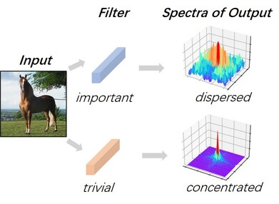

# EZCrop: Energy-Zoned Channels for Robust Output Pruning ([Link](https://arxiv.org/abs/2105.03679))

## Idea

Our key insight is that the energy distribution of feature maps generated by a fixed filter can reflect the filter's importance. The Supplementary Materials can be downloaded [here](https://drive.google.com/file/d/1oBPzJnCtCEs-ATuYGvZXKC5TGYYcV8dj/view?usp=sharing).



## Contributions
+ We analytically bridge the [rank-based channel importance metric](https://openaccess.thecvf.com/content_CVPR_2020/papers/Lin_HRank_Filter_Pruning_Using_High-Rank_Feature_Map_CVPR_2020_paper.pdf) in the spatial domain to an energy perspective in the frequency domain, and for the first time explain the intereting constant-rank phenomenon in a channel matrix.
+ We propose a computationally efficient FFT-based metric for channel importance, which reduces the computational complexity from O(n^3) to O(n^2 logn).
+ The proposed EZCrop algorithm for channel pruning is simple, intuitive and robust. It outperforms other state-of-the-art pruning schemes and consistently delivers good performance, which is not a result of normal variations as confirmed through extensive experiments.


## Citation
If you use EZCrop in your research, please kindly cite this work by
```
@article{lin2021ezcrop,
  title={EZCrop: Energy-Zoned Channels for Robust Output Pruning},
  author={Lin, Rui and Ran, Jie and Wang, Dongpeng and Chiu, King Hung and Wong, Ngai},
  journal={arXiv preprint arXiv:2105.03679},
  year={2021}
}
```

## Runing Codes
To use EZCrop, the users are expected to generate the ratios first, then do the pruning and retrain the pruned model based on the evaluation results. 

### Energy Ratio Generation
```
python ratio_generation.py \
--ratio_path ratio_conv/ \
--EZCrop 1 \
--alpha [A number between 0 and 1] \
--conv_fm 1 \
--data_dir [Your path to the dataset] \
--dataset cifar10 \
--arch [Choose the model architecture] \
--pretrain_dir [Your path to Pretrained model] \
--limit 5 \
--batch_size 128 \
--gpu 0,1 
```

### Model Training
#### CIFAR-10
```
python evaluate_cifar.py \
--data_dir [Your path to the dataset] \
--arch [Choose the model architecture] \
--job_dir [Your path to save trained models] \
--pretrain_dir [Your path to Pretrained model] \
--ratio_conv_prefix [Ratio conv file folder] \
--compress_rate [Compress rate of each conv] \
--gpu 0,1 \
```

#### ImageNet
```
python evaluate.py \
--data_dir [Your path to the dataset] \
--arch [Choose the model architecture] \
--job_dir [Your path to save trained models] \
--pretrain_dir [Your path to Pretrained model] \
--ratio_conv_prefix [Ratio conv file folder] \
--compress_rate [Compress rate of each conv] \
--gpu 0,1 \
```

## Core Codes
```python
def torch_fftshift(real, imag):
    '''
    Input:
        - real: a matrix of size [h, w], which is the real number part of the feature map slice in frequency domain.
        - imag: a matrix of size [h, w], which is the imaginary number part of the feature map slice in frequency domain.
            
    Output:
        - real: a matrix of size [h, w], which is the real number part of the feature map slice in frequency domain 
        after shift operation.
        - imag: a matrix of size [h, w], which is the imaginary number part of the feature map slice in frequency domain
        after shift operation.
    '''
    for dim in range(0, len(real.size())):
        real = torch.roll(real, dims=dim, shifts=real.size(dim)//2)
        imag = torch.roll(imag, dims=dim, shifts=imag.size(dim)//2)
    return real, imag

def StepDecision(h, w, alpha):
    '''
    Input:
        - h: a scalar, which is the height of the given feature map slice.
        - w: a scalar, which is the width of the given feature map slice.
        - alpha: a scalar between 0 and 1, which determines the size of selcted area.
    
    Output:
        - step: a scalar, which decides the selected area of the given feature map in frequency domain.
    '''
    if h % 2 == 0 and w % 2 == 0:
        xc = h / 2
        yc = w / 2
    else:
        xc = (h - 1) / 2
        yc = (w - 1) / 2
    max_h = h - (xc + 1)
    max_w = w - (yc + 1)
    if xc - 1 == 0 or yc - 1 == 0:
        step = 0
    else:
        step = min(int(math.ceil(max_h * alpha)),int(math.ceil(max_w * alpha)))
    return step

def EnergyRatio(fm_slice, alpha=1/4):
    '''
    Input:
        - fm_slice: a matrix of size [h, w], which is a slice of a given feature map in spatial domain.
    
    Output:
        - ratio: a scalar, which is the ratio of the energy of the unselected area of the feature map 
        and the total energy of the feature map (both in frequency domain).
    '''
    FFT_fm_slice = torch.rfft(fm_slice, signal_ndim=2, onesided=False)
    shift_real, shift_imag = torch_fftshift(FFT_fm_slice[:,:,0], FFT_fm_slice[:,:,1])
    FFTshift_fm_slice = (shift_real**2 + shift_imag**2)**(1/2)
    FFTshift_fm_slice = torch.log(FFTshift_fm_slice+1)
    h, w = FFTshift_fm_slice.shape
    step = StepDecision(h, w, alpha)
    if h % 2 == 0 and w % 2 == 0:
        xc = h / 2
        yc = w / 2
    else:
        xc = (h - 1) / 2
        yc = (w - 1) / 2
    E = sum(sum(FFTshift_fm_slice))
    select_FFTshift_fm_slice = FFTshift_fm_slice[int(xc-step):int(xc+step+1), int(yc-step):int(yc+step+1)]
    select_E = sum(sum(select_FFTshift_fm_slice))
    ratio = 1 - select_E / E
    if ratio != ratio:
        ratio = torch.zeros(1)
    return ratio
```

## Experimental Results

### Time
| Dataset | Model | HRank | EZCrop (↓) |
|:----:|:---:|:----:|:----:|
| CIFAR-10 | VGGNet | 1505.54s | 356.94s (76.29%) |
| CIFAR-10 | ResNet-56 | 1247.51s | 381.97s (69.38%) |
| CIFAR-10 | DenseNet-40 | 473.17s | 171.50s (63.76%) |
| ImageNet | ResNet-50 | 7.96h | 3.45h (56.60%) |

### VGGNet @ CIFAR-10
| Params (↓) | FLOPs  (↓) | Top-1% |
|:---:|:---:|:----:|
|2.76M (81.6%) | 131.17M (58.1%) | 94.01 |
|2.50M (83.3%) | 104.78M (66.6%) | 93.70 |

### ResNet-56 @ CIFAR-10
| Params (↓) | FLOPs  (↓) | Top-1% |
|:---:|:---:|:----:|
| 0.56M (34.1%) | 87.84M (30.0%) | 94.18 |
| 0.48M (42.8%) | 65.94M (47.4%) | 93.80 |
| 0.24M (70.0%) | 34.78M (74.1%) | 92.52 |

### DenseNet-40 @ CIFAR-10
| Params (↓) | FLOPs  (↓) | Top-1% |
|:---:|:---:|:----:|
| 0.62M (40.1%) | 173.39M (38.5%) | 94.72 |
| 0.39M (61.9%) | 113.08M (59.9%) | 93.76 |

### ResNet-50 @ ImageNet
| Params | FLOPs | Top-1% | Top-5% |
|:---:|:---:|:----:|:----:|
| 15.09M | 2.26B | 75.68 | 92.70 |
| 11.05M | 1.52B | 92.00 | 74.33 |

### Repetitive Pruning
| #Pass (#epochs) | FLOPs | Params | Top-1% |
|:----:|:----:|:----:|:----:|
| 1 (300) | 90.86M | 0.63M | 93.95 |
| 2 (300) | 66.25M | 0.46M | 93.42 |
| 3 (300) | 36.03M | 0.22M | 92.18 |


## License
EZCrop is released under MIT License.

## Acknowledgements
This code is implemented based on [HRankPlus](https://github.com/lmbxmu/HRankPlus). We thanks for this open-source implementations.

